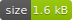
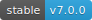

<!-- Screenshot -->
<p align="center">
    
</p>

<!-- Badges -->
<p align="center">
  
  
  
  
  
</p>

# Iodine

Iodine.js is a micro client-side validation library. It has no dependencies and can be used in isolation or as part of a framework. Iodine also supports chainable rules, allowing you to verify that a piece of data satisifies multiple criteria.

## Installation

The easiest way to pull Iodine into your project is via a CDN:

```html
<script src="https://cdn.jsdelivr.net/gh/mattkingshott/iodine@v1.x.x/dist/iodine.min.js" defer></script>
```

## Usage

Iodine is automatically added to the `window` namespace, making it available anywhere on the page / within your application.

## Single checks

Iodine's rules are prefixed with the `is` keyword. So, to check if an item is an `integer`, you'd use the following code:

```js
let item_1 = 7;
let item_2 = 'string';

Iodine.isInteger(item_1); // true
Iodine.isInteger(item_2); // false
```

## Multiple checks

If you want to verify whether an item passes a set of rules, you should use the main `is` method. This method accepts two parameters. The first, is the item you want to check. The second, is an array of rules that should be run in sequence e.g.

```js
let item_1 = 7;
let item_2 = 'string';

Iodine.is(item_1, ['required', 'integer']); // true
Iodine.is(item_2, ['required', 'integer']); // false
```

The `is` method will return `true` if the item passes every rule.

Alternatively, the name of the first rule that failed will be returned e.g. `'integer'`. You are then free to interpret the rule name and display a (localised) error message.

## Additional parameters

Some rules require extra parameters. You can supply them by adding them to the rule with a semicolon separator e.g.

```js
let item_1 = 7;
let item_2 = 'string';

Iodine.is(item_1, ['required', 'integer', 'minimum:5', 'maximum:10']); // true
Iodine.is(item_2, ['required', 'integer', 'minimum:5', 'maximum:10']); // false
```

## Optional values

Sometimes, you may wish to allow for optional values. Iodine supports this with the `optional` rule:

```js
let item_1 = 7;
let item_2 = null;
let item_3 = 'string';

Iodine.is(item_1, ['optional', 'integer']); // true
Iodine.is(item_2, ['optional', 'integer']); // true
Iodine.is(item_3, ['optional', 'integer']); // false
```

**IMPORTANT**: If you wish to allow for optional values, then you must supply `'optional'` as the first rule in the list.

## Available rules

The following validation rules are available:

| Rule                  		| Description                                                                     |
| ----------------------------- | ------------------------------------------------------------------------------- |
| isAfter(date/integer) 		| Verify that the item is a `Date` after a given `Date` or timestamp
| isAfterOrEqual(date/integer) 	| Verify that the item is a `Date` after or equal to a given `Date` or timestamp
| isArray 						| Verify that the item is an `array`
| isBefore(date/integer) 		| Verify that the item is a `Date` before a given `Date` or timestamp
| isBeforeOrEqual(date/integer) | Verify that the item is a `Date` before or equal to a given `Date` or timestamp
| isBoolean             		| Verify that the item is either `true` or `false`
| isDate                		| Verify that the item is a `Date` object
| isDifferent(value)       		| Verify that the item is different to the supplied value (uses strict compare)
| isEndingWith(value)      		| Verify that the item ends with the given value
| isEmail                		| Verify that the item is a valid email address
| isFalsy               		| Verify that the item is either `false`, `'false'`, `0` or `'0'`
| isIn(array)           		| Verify that the item is within the given `array`
| isInteger             		| Verify that the item is an `integer`
| isJson             			| Verify that the item is a parsable JSON object `string`
| isMaximum(limit)      		| Verify that the item does not exceed the given limit (number or char length)
| isMinimum(limit)      		| Verify that the item is not under the given limit (number or char length)
| isNotIn(array)           		| Verify that the item is not within the given `array`
| isNumeric             		| Verify that the item is `number` or a numeric `string`
| isOptional            		| Allow for optional values (only for use with multiple checks)
| isRegexMatch(exp)        		| Verify that the item satisifies the given regular expression
| isRequired            		| Verify that the item is not `null`, `undefined` or an empty `string`
| isSame(value)       			| Verify that the item is the same as the supplied value (uses strict compare)
| isStartingWith(value)    		| Verify that the item starts with the given value
| isString              		| Verify that the item is a `string`
| isTruthy              		| Verify that the item is either `true`, `'true'`, `1` or `'1'`
| isUrl                			| Verify that the item is a valid URL
| isUuid                		| Verify that the item is a `UUID`

Examine the tests for examples of how to use each rule.

## Contributing

Thank you for considering a contribution to Iodine. You are welcome to submit a PR containing additional rules, however to be accepted, they must explain what they do, be useful to others, and include a suitable test to confirm they work correctly.

## Support the project

If you'd like to support the development of Iodine, then please consider [sponsoring me](https://www.paypal.com/cgi-bin/webscr?cmd=_s-xclick&hosted_button_id=YBEHLHPF3GUVY&source=url). Thanks so much!

## License

The MIT License (MIT). Please see [License File](LICENSE.md) for more information.