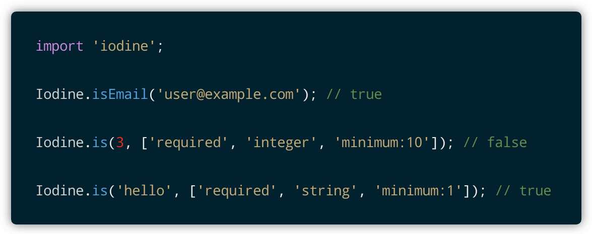

<!-- Screenshot -->
<p align="center">
    
</p>

<!-- Badges -->
<p align="center">
    
    
</p>

# Iodine

Iodine.js is a micro client-side validation library. It has no dependencies and can be used in isolation or as part of a framework. Iodine also supports chainable rules, allowing you to verify that a piece (or pieces) of data satisfy multiple criteria.

## Upgrading

Version 8+ of Iodine involved a major rewrite with numerous breaking changes. It is therefore recommended that existing projects continue to use [version 7](README-LEGACY.MD) (or lower), while version 8 (or higher) should be reserved for newer projects.

## Installation

The easiest way to pull Iodine into your project is via a CDN (be sure to update the build number):

```html
<script src="https://cdn.jsdelivr.net/npm/@kingshott/iodine@8.1.0/dist/iodine.min.umd.js" defer></script>
```

You can also pull Iodine into your project via NPM:

```js
npm i @kingshott/iodine
```

## Promo

I made [Lumeno](https://lumeno.dev) to help you centralize your IT résumé, project portfolio and blog content. It aids in building a following, allows you to discover other creatives, and gets you invited to relevant jobs that match your personal requirements, such as minimum salary, availability, location, commute distance, and much more... [sign up for free!](https://lumeno.dev)

<!-- Screenshot -->
<p align="center">
    <a target="_blank" href="https://lumeno.dev">
        
    </a>
</p>

## Usage

Iodine is automatically added to the `window` namespace, making it available anywhere. This is the recommended way to use Iodine if your project does not involve compilation or imports. Even if your project does involve compilation, it is often easier to just use the instance added to the `window` namespace.

Alternatively, if you are comfortable using imports, or you want to create your own instance, then you can import Iodine like so:

```js
import Iodine from '@kingshott/iodine';

const instance = new Iodine();
```

## Basic Validation

Iodine includes a bunch of validation rules that you can access via their associated methods. This makes it quick and easy to check if an item is, for example, an integer or a date.

Iodine's rules are prefixed with `assert`. So, to check if an item is an `integer`, you'd use the following code:

```js
let item_1 = 7;
let item_2 = 'string';

Iodine.assertInteger(item_1); // true
Iodine.assertInteger(item_2); // false
```

[See below](#available-rules) for a complete list of Iodine's included validation rules.

## Advanced Validation

While checking if an item conforms to an individual validation rule can be useful, you'll often want to check if an item conforms to multiple rules. For example, an email address may be required, must be a string, and must satisfy an email address regular expression.

To address these needs, Iodine offers 'single item checks' and 'multiple item checks'...

### Single Item Checks

This approach is preferred if you have one item that you need to test against multiple rules (like the email address example described above). To perform a 'single item check', call the main `assert` method. The method takes two parameters. The first, is the item to check. The second, is an `array` of validation rules that should be run in sequence e.g.

```js
let item_1 = 7;
let item_2 = 'string';

Iodine.assert(item_1, ['required', 'integer']);
Iodine.assert(item_2, ['required', 'integer']);
```

As you can see in the example, the validation rules are expressed using `strings`. To find the `string` representation for a validation rule, [review the existing list](#available-rules).

Unlike individual assertions (which return a `boolean`), the `assert` method returns an `object` containing a report. When the item passes all of the rules, you'll get this:

```js
{
    valid : true,
    rule  : '',
    error : '',
};
```

If the item fails to validate, the report will contain the first rule that it failed to satisfy, along with the associated error message:

```js
{
    valid : false,
    rule  : 'integer',
    error : 'Value must be an integer',
};
```

### Multiple Item Checks

This approach is preferred when you need to check multiple items against a bunch of different validation rules e.g. when submitting a form containing several fields.

As with 'single item checks', you should call the `assert` method, however for both parameters, you will need to supply an `object`. The first object should contain the items to be validated, while the second should consist of the rules for each item e.g.

```js

const items = {
    name     : 5,
    email    : 'test@example.com',
    password : 'abcdefgh',
};

const rules = {
    name     : ['required', 'string'],
    email    : ['required', 'email'],
    password : ['required'],
};

Iodine.assert(items, rules);
```

Unlike 'single item checks', the report is slightly different. It contains a top level `valid` key that allows you to easily check if everything passed or something failed. It then contains a `fields` key, which contains sub-reports for each item. The sub-report is the same thing you'd get for a 'single item check'. Here's the report for the code example shown above:

```js
{
    valid  : false,
    fields : {
        name : {
            valid : false,
            rule  : 'string',
            error : 'Value must be a string',
        },
        email : {
            valid : true,
            rule  : '',
            error : '',
        },
        password : {
            valid : true,
            rule  : '',
            error : '',
        }
    },
};
```

## Additional parameters

Some rules require extra parameters e.g.

```js
let item_1 = 7;
let item_2 = 4;

Iodine.assertMin(item_1, 5); // true
Iodine.assertMin(item_2, 5); // false
```

For advanced validation, you can supply the parameters by appending them to the rule with a semicolon separator e.g.

```js
let item_1 = 7;
let item_2 = 4;

Iodine.assert(item_1, ['required', 'integer', 'min:5']);
Iodine.assert(item_2, ['required', 'integer', 'min:5']);
```

Or, if you prefer, you can supply the rule as an `object` instead of a `string` separated by a semicolon:

```js
Iodine.assert(8, ['required', 'integer', { rule : 'min', param : 7 }, 'max:10']);
```

## Optional values

For advanced validation, you may wish to allow for optional values. Iodine supports this with the `optional` rule:

```js
let item_1 = 7;
let item_2 = null;
let item_3 = 'string';

Iodine.assert(item_1, ['optional', 'integer']);
Iodine.assert(item_2, ['optional', 'integer']);
Iodine.assert(item_3, ['optional', 'integer']);
```

**IMPORTANT**: If you wish to allow for optional values, then it must be the first rule in the array.

## Custom Errors

Iodine includes a default set of error messages for the English language. However, you can easily replace them via the `setErrorMessages` method. This method requires a single parameter, which is an `object` containing the messages. See Iodine's [constructor](src/iodine.js) for an example.

Iodine will automatically replace the `[FIELD]` and `[PARAM]` placeholders when an error occurs. As such, you should insert these placeholders at the appropriate position in your new error message e.g.

```js
Iodine.setErrorMessages({ same : `[FIELD] must be '[PARAM]'` });   // English
Iodine.setErrorMessages({ same : `[FIELD] doit être '[PARAM]'` }); // French
```

### Single Errors

In many cases, you won't need to replace all of the error messages. You'll instead want to update one or add a new one. To do that, you should instead call `setErrorMessage` e.g.

```js
Iodine.setErrorMessage('passwordConfirmation', 'Does not match password');
```

### Default field name

Since 'single item checks' don't support field names, Iodine uses the default instead (which is 'Value'). If 'Value' is not suitable, then you can call the `setDefaultFieldName` method and supply an alternative `string` value to use instead e.g.

```js
Iodine.setDefaultFieldName('Valeur');
```

Note that you must call `setDefaultFieldName` before calling `assert`.

## Available rules

The following validation rules are available:

| Rule                              | String Key      | Description                                                                     |
| --------------------------------- | --------------- | ------------------------------------------------------------------------------- |
| assertAfter(date/integer)         | 'after'         | Verify that the item is a `Date` after a given `Date` or timestamp
| assertAfterOrEqual(date/integer)  | 'afterOrEqual'  | Verify that the item is a `Date` after or equal to a given `Date` or timestamp
| assertArray                       | 'array'         | Verify that the item is an `array`
| assertBefore(date/integer)        | 'before'        | Verify that the item is a `Date` before a given `Date` or timestamp
| assertBeforeOrEqual(date/integer) | 'beforeOrEqual' | Verify that the item is a `Date` before or equal to a given `Date` or timestamp
| assertBoolean                     | 'boolean'       | Verify that the item is either `true` or `false`
| assertDate                        | 'date'          | Verify that the item is a `Date` object
| assertDifferent(value)            | 'different'     | Verify that the item is different to the supplied value (uses loose compare)
| assertEnds(value)                 | 'ends'          | Verify that the item ends with the given value
| assertEmail                       | 'email'         | Verify that the item is a valid email address
| assertFalsy                       | 'falsy'         | Verify that the item is either `false`, `'false'`, `0` or `'0'`
| assertIn(array)                   | 'in'            | Verify that the item is within the given `array`
| assertInteger                     | 'integer'       | Verify that the item is an `integer`
| assertJson                        | 'json'          | Verify that the item is a parsable JSON object `string`
| assertMaxLength(limit)            | 'maxLength'     | Verify that the item's character length does not exceed the given limit
| assertMinLength(limit)            | 'minLength'     | Verify that the item's character length is not under the given limit
| assertMax(limit)                  | 'max'           | Verify that the item's numerical value does not exceed the given limit
| assertMin(limit)                  | 'min'           | Verify that the item's numerical value is not under the given limit
| assertNotIn(array)                | 'notIn'         | Verify that the item is not within the given `array`
| assertNumeric                     | 'numeric'       | Verify that the item is `number` or a numeric `string`
| assertOptional                    | 'optional'      | Allow for optional values (only for use with multiple checks)
| assertRegexMatch(exp)             | 'regexMatch'    | Verify that the item satisfies the given regular expression
| assertRequired                    | 'required'      | Verify that the item is not `null`, `undefined` or an empty `string`
| assertSame(value)                 | 'same'          | Verify that the item is the same as the supplied value (uses loose compare)
| assertStartsWith(value)           | 'startsWith'    | Verify that the item starts with the given value
| assertString                      | 'string'        | Verify that the item is a `string`
| assertTruthy                      | 'truthy'        | Verify that the item is either `true`, `'true'`, `1` or `'1'`
| assertUrl                         | 'url'           | Verify that the item is a valid URL
| assertUuid                        | 'uuid'          | Verify that the item is a `UUID`

Examine the tests for examples of how to use each rule.

## Custom rules

Iodine allows you to add your own custom validation rules through the `rule` method. This method accepts two parameters. The first, is the name of the rule. The second, is the `closure` that Iodine should execute when calling the rule e.g.

```js
Iodine.rule('lowerCase', (value) => value === value.toLowerCase());
```

**IMPORTANT**: Iodine will automatically make the first letter of the rule's name uppercase and prefix it with 'assert'. You should therefore avoid adding the prefix yourself e.g.

```js
Iodine.rule('lowerCase');       // right
Iodine.rule('assertLowerCase'); // wrong
```

If your rule needs to accept a parameter, simply include it in your `closure` as the second argument e.g.

```js
Iodine.rule('equals', (value, param) => value == param);
```

You can also add error messages for your custom rules e.g.

```js
Iodine.rule('equals', (value, param) => value == param);
Iodine.setErrorMessage('equals', "[FIELD] must be equal to '[PARAM]'");
```

## Asynchronous rules

Previous versions of Iodine supported asynchronous custom rules using `async / await`. This has since been removed to make the library easier to maintain. If you were using asynchronous rules, then the preferred strategy is to execute your asynchronous logic first, store the result, and then have Iodine validate it.

## Contributing

Thank you for considering a contribution to Iodine. You are welcome to submit a PR containing additional rules, however to be accepted, they must explain what they do, be useful to others, and include a suitable test to confirm they work correctly.

After pulling the project, to install the dependencies:

```bash
npm install
```

To run the tests
```bash
npm run test
```

## Support the project

If you'd like to support the development of Iodine, then please consider [sponsoring me](https://www.paypal.com/cgi-bin/webscr?cmd=_s-xclick&hosted_button_id=YBEHLHPF3GUVY&source=url). Thanks so much!

## License

The MIT License (MIT). Please see [License File](LICENSE.md) for more information.
